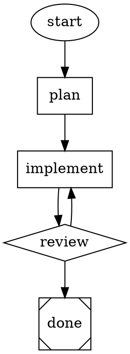

# Attractor

An implementation of [StrongDM's Attractor](https://github.com/strongdm/attractor) -- a DOT-based pipeline runner for orchestrating multi-stage AI workflows.

Attractor lets you define AI workflows as Graphviz DOT files. Each node in the graph is a task (LLM call, human review, conditional branch, shell command) and edges define the flow between them. The engine walks the graph, calling LLMs at each stage, branching on conditions, and producing results.



## What is this?

StrongDM published a set of [natural language specifications](https://github.com/strongdm/attractor) (nlspecs) describing a 3-layer AI workflow platform:

1. **Unified LLM Client** -- single interface across OpenAI, Anthropic, and Google Gemini
2. **Coding Agent Loop** -- autonomous agentic loop pairing LLMs with developer tools
3. **Attractor Pipeline Engine** -- DOT-graph orchestrator that chains LLM calls into workflows

They published the specs but no implementation. This repo is an implementation of those specs.

## Quick Start

Requires Python 3.12+ and [uv](https://docs.astral.sh/uv/).

```bash
# Clone
git clone https://github.com/samueljklee/attractor.git
cd attractor

# Install
uv sync

# Run the end-to-end test (requires Anthropic API key)
ANTHROPIC_API_KEY=sk-... uv run python examples/e2e_test.py
```

The e2e test parses a DOT pipeline, calls Claude Sonnet 4.5 at each stage, and produces real code output. Takes about 7 seconds.

## How It Works

### Node Shapes

The shape of each node determines what happens when the engine reaches it:

| Shape | Node Type | What It Does |
|-------|-----------|-------------|
| `ellipse` | Start | Entry point (no-op) |
| `box` | Codergen | Calls an LLM with the node's prompt |
| `diamond` | Conditional | Branches based on edge conditions |
| `house` | Human Gate | Waits for human approval |
| `parallelogram` | Tool | Runs a shell command |
| `Msquare` | Exit | Terminal node (pipeline complete) |

### Edge Selection

When a node completes, the engine selects the next edge using a 5-step priority algorithm:

1. **Condition match** -- edges whose condition evaluates to true
2. **Preferred label** -- edges matching the handler's suggested label
3. **Suggested IDs** -- edges targeting a handler-suggested node
4. **Weight** -- highest-weight unconditional edge
5. **Dead end** -- no valid edge found, pipeline ends

### Three-Layer Architecture

```
DOT File (.dot)
    |
    v
Attractor Pipeline Engine          <-- Parses DOT, walks graph, runs handlers
    |
    v
Coding Agent Loop                   <-- Agentic loop with tools (read/write/edit/shell)
    |
    v
Unified LLM Client                  <-- Provider adapters (Anthropic, OpenAI, Gemini)
    |
    v
Provider APIs                       <-- Claude, GPT, Gemini
```

## Project Structure

```
src/
├── attractor_llm/              # Layer 1: Unified LLM Client
│   ├── types.py                 # Request, Response, Message, ContentPart, Usage
│   ├── errors.py                # Error hierarchy with retryability classification
│   ├── retry.py                 # Exponential backoff, honors Retry-After headers
│   ├── catalog.py               # Model catalog (7 models across 3 providers)
│   ├── streaming.py             # StreamAccumulator for building responses from SSE
│   ├── client.py                # Client with provider routing
│   └── adapters/
│       ├── base.py              # ProviderAdapter protocol + ProviderConfig
│       ├── anthropic.py         # Anthropic Messages API adapter
│       ├── openai.py            # OpenAI Responses API adapter
│       └── gemini.py            # Google Gemini native API adapter
│
├── attractor_agent/             # Layer 2: Coding Agent Loop
│   ├── session.py               # Core agentic loop (LLM -> tools -> repeat)
│   ├── events.py                # Event system (12 event kinds)
│   ├── abort.py                 # Cooperative cancellation (AbortSignal)
│   ├── truncation.py            # Two-pass output truncation
│   └── tools/
│       ├── registry.py          # Tool registry and execution pipeline
│       └── core.py              # 6 tools: read_file, write_file, edit_file, shell, grep, glob
│
├── attractor_pipeline/          # Layer 3: Pipeline Engine
│   ├── graph.py                 # Graph, Node, Edge data model
│   ├── conditions.py            # Condition expression evaluator (=, !=, &&)
│   ├── backends.py              # CodergenBackend implementations (Direct + AgentLoop)
│   ├── parser/
│   │   └── parser.py            # Custom recursive-descent DOT parser
│   ├── engine/
│   │   └── runner.py            # Core execution loop, edge selection, checkpoint
│   └── handlers/
│       ├── basic.py             # Start, Exit, Conditional, Tool handlers
│       ├── codergen.py          # LLM handler + CodergenBackend protocol
│       └── human.py             # Human-in-the-loop + Interviewer protocol
│
└── examples/
    └── e2e_test.py              # End-to-end test against real Anthropic API
```

## What's Implemented

Mapped against the three StrongDM nlspecs.

### Unified LLM Client Spec

| Feature | Status | Spec Section |
|---------|--------|-------------|
| Client with provider routing | Done | §2.1-2.6 |
| Anthropic Messages API adapter | Done | §7.3 |
| OpenAI Responses API adapter | Done | §7.3 |
| Google Gemini native API adapter | Done | §7.4 |
| Request/Response data model | Done | §3 |
| Streaming with StreamAccumulator | Done | §3.13 |
| Error hierarchy with retryability | Done | §6 |
| Retry with exponential backoff | Done | §6.6 |
| Prompt caching (cache_control injection) | Done | §2.10 |
| Reasoning token tracking | Done | §3.9 |
| Model catalog | Done | §2.9 |
| Tool calling (parallel execution) | Done | §5 |
| High-level generate()/stream() API | Not yet | §4.3-4.6 |
| generate_object() structured output | Not yet | §4.5 |
| Middleware/interceptor chain | Not yet | §2.3 |
| OpenAI-compatible adapter | Not yet | §7.10 |

### Coding Agent Loop Spec

| Feature | Status | Spec Section |
|---------|--------|-------------|
| Session with agentic loop | Done | §2.1-2.5 |
| Tool registry and execution pipeline | Done | §3.8 |
| Core tools (read/write/edit/shell/grep/glob) | Done | §3.3 |
| Output truncation (char + line) | Done | §5.1-5.3 |
| Event system (12 event kinds) | Done | §2.9 |
| Steering/follow-up queues | Done | §2.6 |
| Loop detection | Done | §2.10 |
| Cooperative cancellation (AbortSignal) | Done | §2.8 |
| Path confinement security | Done | (swarm-designed) |
| Shell command deny-list | Done | (swarm-designed) |
| Provider-aligned profiles (codex-rs, Claude Code, gemini-cli) | Not yet | §3.4-3.6 |
| apply_patch v4a format parser | Not yet | Appendix A |
| Subagent spawning | Not yet | §7 |
| System prompt layering | Not yet | §6 |
| Execution environment abstraction (Docker, K8s) | Not yet | §4 |

### Attractor Pipeline Spec

| Feature | Status | Spec Section |
|---------|--------|-------------|
| Custom DOT parser | Done | §2 |
| Graph model (Node, Edge, Graph) | Done | §2.3-2.7 |
| Execution engine (core loop) | Done | §3.2 |
| 5-step edge selection algorithm | Done | §3.3 |
| Goal gate with circuit breaker | Done | §3.4 |
| Node retry with backoff | Done | §3.5 |
| Checkpoint/resume | Done | §5.3 |
| Condition expression evaluator | Done | §10 |
| Handlers: start, exit, codergen, conditional, tool, human | Done | §4.3-4.10 |
| CodergenBackend protocol + implementations | Done | §4.5 |
| Interviewer protocol (AutoApprove, Console) | Done | §6 |
| Cooperative cancellation | Done | §9.5 |
| Graph validation/lint rules (12 rules) | Not yet | §7 |
| Model stylesheet parser (CSS-like selectors) | Not yet | §8 |
| Parallel handler (fan-out) | Not yet | §4.8 |
| Fan-in handler (join) | Not yet | §4.9 |
| Manager loop handler (supervisor) | Not yet | §4.11 |
| HTTP server mode + SSE events | Not yet | §9.5-9.6 |
| AST transforms (variable expansion, preamble) | Not yet | §9.1-9.3 |
| Fidelity resume preamble generation | Not yet | §5.4 |

## Security

The implementation includes security hardening identified during multi-model peer review:

- **Path confinement**: All file tools validate paths against an allowed-roots list. Operations outside the allowed directories are rejected.
- **Shell command deny-list**: Dangerous patterns (`rm -rf /`, `mkfs`, fork bombs, `sudo rm`) are blocked before execution.
- **Shell variable injection prevention**: Context values are escaped with `shlex.quote()` before substitution into shell commands.
- **Environment variable filtering**: Sensitive variables (matching `_KEY`, `_SECRET`, `_TOKEN`, `_PASSWORD` suffixes) are stripped from child process environments.
- **Non-blocking shell execution**: Shell commands run in a thread pool via `asyncio.to_thread()` to avoid blocking the event loop.
- **No traceback leakage**: Tool errors sent to the LLM contain only the exception message, not internal stack traces.

## Development

```bash
# Install with dev dependencies
uv sync --extra dev

# Run linter
uv run ruff check src/

# Run type checker
uv run pyright src/

# Run pipeline integration tests
uv run python tests/test_pipeline.py

# Run end-to-end test (requires API key)
ANTHROPIC_API_KEY=sk-... uv run python examples/e2e_test.py
```

## Credits

This is an implementation of the [Attractor nlspec](https://github.com/strongdm/attractor) published by [StrongDM](https://www.strongdm.com/). The specifications (attractor-spec.md, coding-agent-loop-spec.md, unified-llm-spec.md) were designed by StrongDM's team. This implementation was built from those specs using [Amplifier](https://github.com/microsoft/amplifier) with multi-model peer review across Claude, GPT, and Gemini.

## License

This implementation is provided as-is. The original Attractor specifications are licensed under [Apache License 2.0](https://github.com/strongdm/attractor/blob/main/LICENSE) by StrongDM.
