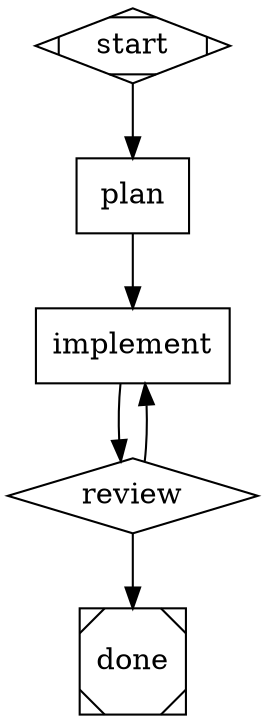
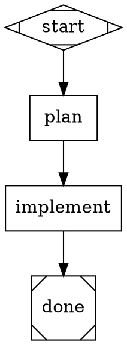
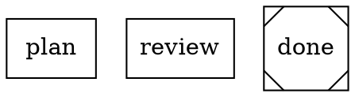
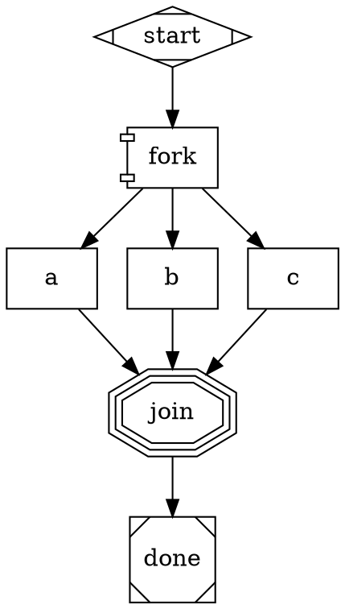
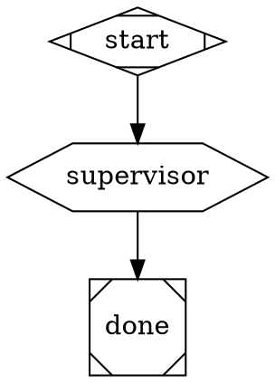

# Attractor

An implementation of [StrongDM's Attractor](https://github.com/strongdm/attractor) -- a DOT-based pipeline runner for orchestrating multi-stage AI workflows.

Attractor lets you define AI workflows as Graphviz DOT files. Each node in the graph is a task (LLM call, human review, conditional branch, shell command) and edges define the flow between them. The engine walks the graph, calling LLMs at each stage, branching on conditions, and producing results.



## What is this?

StrongDM published a set of [natural language specifications](https://github.com/strongdm/attractor) (nlspecs) describing a 3-layer AI workflow platform:

1. **Unified LLM Client** -- single interface across OpenAI, Anthropic, Google Gemini, and any OpenAI-compatible server
2. **Coding Agent Loop** -- autonomous agentic loop pairing LLMs with developer tools
3. **Attractor Pipeline Engine** -- DOT-graph orchestrator that chains LLM calls into workflows

They published the specs but no implementation. This repo is an implementation of those specs.

## Quick Start

Requires Python 3.12+ and [uv](https://docs.astral.sh/uv/).

```bash
# Clone and install
git clone https://github.com/samueljklee/attractor.git
cd attractor
uv sync

# Run a pipeline via CLI (requires API key)
ANTHROPIC_API_KEY=sk-... uv run python -m attractor_pipeline.cli run examples/fibonacci.dot --no-tools

# Run with OpenAI
OPENAI_API_KEY=sk-... uv run python -m attractor_pipeline.cli run examples/fibonacci.dot --no-tools --provider openai --model gpt-4.1-mini

# Run with Gemini
GOOGLE_API_KEY=... uv run python -m attractor_pipeline.cli run examples/fibonacci.dot --no-tools --provider gemini --model gemini-2.5-flash

# Validate a pipeline (no API key needed)
uv run python -m attractor_pipeline.cli validate examples/fibonacci.dot

# Start the HTTP server
ANTHROPIC_API_KEY=sk-... uv run python -m attractor_server --port 8080
```

## HTTP Server

Attractor exposes a REST API with SSE event streaming (spec S9.5-9.6):

```bash
# Start server
uv run python -m attractor_server --port 8080

# Submit a pipeline
curl -X POST http://localhost:8080/pipelines \
  -H "Content-Type: application/json" \
  -d '{"dot_source": "digraph { start [shape=Mdiamond]; task [shape=box, prompt=\"Write a haiku\"]; done [shape=Msquare]; start -> task -> done }"}'

# Watch events in real-time (SSE)
curl -N http://localhost:8080/pipelines/{id}/events

# Check status
curl http://localhost:8080/pipelines/{id}

# Cancel a running pipeline
curl -X POST http://localhost:8080/pipelines/{id}/cancel
```

### 9 Endpoints

| Method | Path | Description |
|--------|------|-------------|
| `POST` | `/pipelines` | Start a pipeline from DOT source |
| `GET` | `/pipelines/{id}` | Pipeline status and progress |
| `GET` | `/pipelines/{id}/events` | SSE event stream (real-time) |
| `POST` | `/pipelines/{id}/cancel` | Cancel a running pipeline |
| `GET` | `/pipelines/{id}/graph` | Graph structure as JSON |
| `GET` | `/pipelines/{id}/questions` | Pending human gate questions |
| `POST` | `/pipelines/{id}/questions/{qid}/answer` | Answer a human gate question |
| `GET` | `/pipelines/{id}/checkpoint` | Checkpoint state |
| `GET` | `/pipelines/{id}/context` | Context key-value store |

### SSE Event Types

```
event: pipeline.started
data: {"id": "abc123", "name": "MyPipeline", "goal": "Build a widget"}

event: pipeline.completed
data: {"id": "abc123", "duration": 12.3, "nodes_completed": 5}

event: interview.started
data: {"qid": "q_abc", "question": "Deploy to production?", "stage": "gate"}

event: pipeline.failed
data: {"id": "abc123", "error": "...", "duration": 8.1}
```

Late-connecting SSE clients receive the full event history replay.

## How It Works

### Node Shapes

| Shape | Node Type | What It Does |
|-------|-----------|-------------|
| `Mdiamond` | Start | Entry point (no-op) |
| `box` | Codergen | Calls an LLM with the node's prompt |
| `diamond` | Conditional | Branches based on edge conditions |
| `house` | Human Gate | Waits for human approval (CLI or HTTP) |
| `hexagon` | Manager | Supervisor: runs a child pipeline, retries on failure |
| `parallelogram` | Tool | Runs a shell command |
| `component` | Parallel | Fans out to concurrent branches |
| `tripleoctagon` | Fan-In | Collects results from parallel branches |
| `Msquare` | Exit | Terminal node (pipeline complete) |

### Variable Expansion

Node prompts support `$variable` and `${variable}` expansion from the pipeline context:



Escaped `\$literal` produces a literal `$` (no expansion).

### Model Stylesheets

Assign LLM models to nodes using CSS-like selectors:



Specificity: `*` (0) < `shape` (1) < `.class` (2) < `#id` (3). Explicit node attributes always override.

### Parallel Execution



### Supervisor / Manager Loop

A hexagon node runs a child pipeline and retries if it fails:



### System Prompt Layering

The system prompt is composed from 4 layers (highest priority wins):

1. **Profile** -- provider-specific base (Claude Code style, codex-rs style)
2. **Pipeline goal** -- `[GOAL]` section from the DOT graph
3. **Node instruction** -- `[INSTRUCTION]` from per-node `system_prompt` attribute
4. **User override** -- replaces everything if set

### Three-Layer Architecture

```
HTTP Server (REST + SSE)            <-- 9 endpoints, real-time events
    |
    v
DOT File (.dot)
    |
    v
Attractor Pipeline Engine          <-- Parses DOT, walks graph, runs handlers
    |
    v
Coding Agent Loop                   <-- Agentic loop with tools (read/write/edit/shell)
    |
    v
Unified LLM Client                  <-- Provider adapters + middleware
    |
    v
Provider APIs                       <-- Claude, GPT, Gemini, Ollama, vLLM
```

### High-Level API

Use the SDK directly without pipelines:

```python
from attractor_llm.generate import generate, generate_object, stream

# Simple text generation
text = await generate(client, "claude-sonnet-4-5", "Explain recursion")

# With automatic tool loop
text = await generate(client, "claude-sonnet-4-5", "Read config.py",
                      tools=[read_file_tool], max_rounds=5)

# Structured JSON output
data = await generate_object(client, "claude-sonnet-4-5",
                              "Extract entities from: ...",
                              schema={"type": "object", ...})

# Streaming
async for chunk in stream(client, "claude-sonnet-4-5", "Write a poem"):
    print(chunk, end="")
```

### Middleware

Intercept LLM requests and responses for logging, caching, token counting, rate limiting:

```python
from attractor_llm.middleware import (
    apply_middleware, LoggingMiddleware,
    TokenCountingMiddleware, CachingMiddleware,
)

client = apply_middleware(client, [
    LoggingMiddleware(),
    TokenCountingMiddleware(),
    CachingMiddleware(max_size=100),
])
# Client works normally -- middleware intercepts transparently
```

### Subagent Spawning

Delegate tasks to child agent sessions with depth limiting:

```python
from attractor_agent.subagent import spawn_subagent

result = await spawn_subagent(
    client=client,
    prompt="Refactor the auth module",
    parent_depth=0, max_depth=3,
    model="claude-sonnet-4-5", provider="anthropic",
)
print(result.text)
```

## Project Structure

```
src/
├── attractor_llm/              # Layer 1: Unified LLM Client
│   ├── types.py                 # Request, Response, Message, ContentPart, Usage
│   ├── errors.py                # Error hierarchy with retryability classification
│   ├── retry.py                 # Exponential backoff, honors Retry-After headers
│   ├── catalog.py               # Model catalog (7 models across 3 providers)
│   ├── streaming.py             # StreamAccumulator for building responses from SSE
│   ├── client.py                # Client with provider routing
│   ├── generate.py              # High-level generate(), stream(), generate_object()
│   ├── middleware.py             # Middleware chain (logging, tokens, cache, rate limit)
│   └── adapters/
│       ├── base.py              # ProviderAdapter protocol + ProviderConfig
│       ├── anthropic.py         # Anthropic Messages API adapter
│       ├── openai.py            # OpenAI Responses API adapter
│       ├── gemini.py            # Google Gemini native API adapter
│       └── openai_compat.py     # OpenAI-compatible adapter (Ollama, vLLM, LiteLLM)
│
├── attractor_agent/             # Layer 2: Coding Agent Loop
│   ├── session.py               # Core agentic loop (LLM -> tools -> repeat)
│   ├── events.py                # Event system (12 event kinds)
│   ├── abort.py                 # Cooperative cancellation (AbortSignal)
│   ├── truncation.py            # Two-pass output truncation
│   ├── subagent.py              # Subagent spawning with depth limiting
│   ├── prompt_layer.py          # 4-layer system prompt composition
│   ├── environment.py           # ExecutionEnvironment protocol (Local + Docker)
│   ├── profiles/                # Provider-specific agent configurations
│   │   ├── anthropic.py         # Claude Code-style profile
│   │   ├── openai.py            # codex-rs-style profile
│   │   └── gemini.py            # gemini-cli-style profile
│   └── tools/
│       ├── registry.py          # Tool registry and execution pipeline
│       ├── core.py              # 7 tools: read_file, write_file, edit_file, apply_patch, shell, grep, glob
│       └── apply_patch.py       # Unified diff parser with context verification
│
├── attractor_pipeline/          # Layer 3: Pipeline Engine
│   ├── graph.py                 # Graph, Node, Edge data model
│   ├── conditions.py            # Condition expression evaluator (=, !=, &&)
│   ├── backends.py              # CodergenBackend implementations (Direct + AgentLoop)
│   ├── validation.py            # 12 graph lint rules
│   ├── stylesheet.py            # CSS-like model selector engine
│   ├── variable_expansion.py    # $variable and ${variable} expansion
│   ├── cli.py                   # CLI: attractor run/validate
│   ├── parser/
│   │   └── parser.py            # Custom recursive-descent DOT parser
│   ├── engine/
│   │   ├── runner.py            # Core execution loop, edge selection, checkpoint
│   │   ├── subgraph.py          # Branch execution primitive for parallel
│   │   └── preamble.py          # Fidelity resume preamble for checkpoint continuation
│   └── handlers/
│       ├── basic.py             # Start, Exit, Conditional, Tool handlers
│       ├── codergen.py          # LLM handler + CodergenBackend protocol
│       ├── human.py             # Human-in-the-loop + Interviewer protocol
│       ├── parallel.py          # Parallel fan-out + Fan-in handlers
│       └── manager.py           # Supervisor loop handler (child pipeline orchestration)
│
├── attractor_server/            # HTTP Server (REST + SSE)
│   ├── app.py                   # Starlette app with 9 endpoints
│   ├── pipeline_manager.py      # Pipeline lifecycle (start, track, cancel, evict)
│   ├── sse.py                   # SSE event formatting + streaming + history replay
│   ├── interviewer.py           # WebInterviewer (HTTP-bridged human gates)
│   ├── models.py                # Pydantic request/response schemas
│   └── __main__.py              # Entry point: uv run python -m attractor_server
│
└── examples/
    ├── fibonacci.dot              # Basic: plan -> implement
    ├── code_review.dot            # Review loop with retry
    ├── research_then_build.dot    # Research -> design -> implement
    ├── parallel_approaches.dot    # Fan-out/fan-in (3 concurrent branches)
    ├── model_stylesheet.dot       # CSS-like model selectors
    ├── supervisor_loop.dot        # Manager/supervisor pattern
    ├── supervisor_child.dot       # Child pipeline for supervisor
    ├── conditional_goal_gate.dot  # Review loop with goal gate circuit breaker
    ├── software_factory.dot       # 5-stage: research -> design -> implement -> test -> review
    ├── human_approval.dot         # Human-in-the-loop approval gate
    ├── variable_expansion.dot     # Full $variable expansion across stages
    ├── prompt_layering.dot        # Per-node system_prompt with [INSTRUCTION] sections
    ├── openai_compat_ollama.py    # OpenAI-compat adapter with Ollama/vLLM
    └── e2e_test.py                # End-to-end pipeline test
```

## Spec Coverage (100%)

### Unified LLM Client Spec

| Feature | Status | Spec Section |
|---------|--------|-------------|
| Client with provider routing | Done | S2.1-2.6 |
| Anthropic Messages API adapter | Done | S7.3 |
| OpenAI Responses API adapter | Done | S7.3 |
| Google Gemini native API adapter | Done | S7.4 |
| OpenAI-compatible adapter (Ollama, vLLM, LiteLLM) | Done | S7.10 |
| Request/Response data model | Done | S3 |
| Streaming with StreamAccumulator | Done | S3.13 |
| Error hierarchy with retryability | Done | S6 |
| Retry with exponential backoff | Done | S6.6 |
| Prompt caching (cache_control injection) | Done | S2.10 |
| Reasoning token tracking | Done | S3.9 |
| Model catalog | Done | S2.9 |
| Tool calling (parallel execution) | Done | S5 |
| High-level generate()/stream() API | Done | S4.3-4.6 |
| generate_object() structured output | Done | S4.5 |
| Middleware/interceptor chain | Done | S2.3 |

### Coding Agent Loop Spec

| Feature | Status | Spec Section |
|---------|--------|-------------|
| Session with agentic loop | Done | S2.1-2.5 |
| Tool registry and execution pipeline | Done | S3.8 |
| Core tools (read/write/edit/shell/grep/glob) | Done | S3.3 |
| apply_patch v4a unified diff parser | Done | Appendix A |
| Output truncation (char + line) | Done | S5.1-5.3 |
| Event system (12 event kinds) | Done | S2.9 |
| Steering/follow-up queues | Done | S2.6 |
| Loop detection | Done | S2.10 |
| Cooperative cancellation (AbortSignal) | Done | S2.8 |
| Path confinement + symlink defense | Done | (multi-model designed) |
| Shell command deny-list | Done | (multi-model designed) |
| Provider profiles (Claude Code, codex-rs, gemini-cli) | Done | S3.4-3.6 |
| Subagent spawning with depth limiting | Done | S7 |
| System prompt layering (4-layer) | Done | S6 |
| Execution environment abstraction (Local + Docker) | Done | S4 |

### Attractor Pipeline Spec

| Feature | Status | Spec Section |
|---------|--------|-------------|
| Custom DOT parser | Done | S2 |
| Graph model (Node, Edge, Graph) | Done | S2.3-2.7 |
| Execution engine (core loop) | Done | S3.2 |
| 5-step edge selection algorithm | Done | S3.3 |
| Goal gate with circuit breaker | Done | S3.4 |
| Node retry with backoff | Done | S3.5 |
| Checkpoint/resume with fidelity preamble | Done | S5.3-5.4 |
| Condition expression evaluator | Done | S10 |
| Handlers: start, exit, codergen, conditional, tool, human | Done | S4.3-4.10 |
| Manager loop handler (supervisor) | Done | S4.11 |
| Parallel handler (fan-out) | Done | S4.8 |
| Fan-in handler (join with heuristic selection) | Done | S4.9 |
| CodergenBackend protocol + implementations | Done | S4.5 |
| Interviewer protocol (AutoApprove, Console, Web) | Done | S6 |
| Cooperative cancellation | Done | S9.5 |
| Graph validation/lint rules (12 rules) | Done | S7 |
| Model stylesheet parser (CSS-like selectors) | Done | S8 |
| Variable expansion ($var, ${var}) | Done | S9.1-9.3 |
| HTTP server mode + SSE events (9 endpoints) | Done | S9.5-9.6 |
| CLI (run + validate) | Done | -- |

## Testing

```bash
# Run all unit tests (432 tests, ~3s, no API keys needed)
uv run python -m pytest tests/ -q

# Run end-to-end integration tests (8 tests, requires ANTHROPIC_API_KEY)
uv run python -m pytest tests/test_e2e_integration.py -v -s

# Run the quick e2e pipeline test
ANTHROPIC_API_KEY=sk-... uv run python examples/e2e_test.py
```

### Test Coverage

| Test Type | Count | What It Covers |
|-----------|-------|---------------|
| Unit tests (mock) | 432 | Types, errors, retry, streaming, tools, parser, conditions, validation, stylesheet, profiles, subagent, apply_patch, generate API, parallel, manager, middleware, prompt layering, variable expansion, preamble, HTTP server (32 endpoint tests), SSE formatting, WebInterviewer, execution environment (25 tests: Local + Docker) |
| E2E integration (real API) | 8 | Agent writes/edits real files, pipeline creates code on disk, multi-stage output chaining, generate() with tool loop, structured output, subagent with tools, software factory |
| Live provider validation | 30+ | generate + generate_object + subagent across Anthropic + OpenAI + Gemini; HTTP server endpoints via real curl; SSE event streaming; pipeline cancel mid-run; questions/answer flow; concurrent SSE clients; multi-provider server backends; Docker environment (start, write, read, exec, grep, apply_patch inside real container); pipeline execution inside Docker with real Claude API |

### What's Proven End-to-End

- Agent writes files to disk via agentic tool loop (real LLM + real filesystem)
- Agent reads and edits existing files, preserving unchanged content
- Pipeline node drives AgentLoopBackend which creates code on disk
- Multi-stage pipeline: plan output chains into implement stage
- `generate()` reads a file via tool loop and extracts data
- `generate_object()` returns structured JSON from natural language
- Subagent writes files to disk using delegated tool access
- Software factory pipeline produces working code
- HTTP server: all 9 endpoints verified via curl against real Claude API
- SSE events: `pipeline.started` + `pipeline.completed` streamed in real-time
- SSE late-connect: full event history replayed to clients connecting after completion
- Pipeline cancel: abort signal propagated mid-run, status correctly transitions
- Human gates: questions appear, answers unblock pipeline, timeout returns default
- Concurrent SSE: 3 simultaneous clients all receive events
- All 3 providers (Anthropic, OpenAI, Gemini) tested as server backends
- Docker environment: start container, write/read/exec/grep/apply_patch all inside real Docker
- Pipeline execution inside Docker container with real Claude API
- grep routes through `docker exec grep` when DockerEnvironment is active
- apply_patch reads/writes via `docker exec` inside container

## Security

Security hardening identified during multi-model peer review (Claude, GPT, Gemini):

- **Path confinement**: All file tools validate paths against an allowed-roots list
- **Symlink traversal defense**: Resolved paths verified under base directory via `relative_to()`
- **Shell command deny-list**: Dangerous patterns (`rm -rf /`, `mkfs`, fork bombs) blocked
- **Shell variable injection prevention**: Context values escaped with `shlex.quote()`
- **Environment variable filtering**: Sensitive variables (`_KEY`, `_SECRET`, `_TOKEN`) stripped
- **Non-blocking shell execution**: Commands run via `asyncio.to_thread()`
- **No traceback leakage**: Tool errors contain only the exception message
- **apply_patch context verification**: Verifies diff context lines match actual file content before applying; rejects overlapping hunks
- **DOT injection prevention**: `$goal` expansion sanitizes structural characters (backslash-first escaping, `->` neutralization)
- **Hunk overlap detection**: Prevents silent file corruption from malformed patches

## How This Was Built

This implementation was built using [Amplifier](https://github.com/microsoft/amplifier) with a multi-model peer review process:

- **Design phase**: Each feature planned with spec analysis, then reviewed by multiple models before implementation
- **Implementation phase**: Code reviewed by 2-4 models per feature (Claude Opus 4.6, Sonnet 4.5, GPT O3, Gemini), with cross-reviews where one model verifies another's fixes
- **Validation phase**: Every feature tested with mock tests AND live API calls against all 3 providers
- **Security**: Opus 4.6 found a DOT injection-to-execution chain that Sonnet and Gemini both missed; Gemini found a parallel context deepcopy race; O3 found an apply_patch hunk overlap corruption bug
- **Total**: 35+ swarm review rounds, 48 commits, ~21,000 lines of code

## Development

```bash
# Install with dev dependencies
uv sync --extra dev

# Run linter
uv run ruff check src/

# Run type checker
uv run pyright src/

# Run all tests
uv run python -m pytest tests/ -v

# Run a pipeline via CLI
uv run python -m attractor_pipeline.cli run examples/fibonacci.dot --no-tools

# Validate a DOT file
uv run python -m attractor_pipeline.cli validate examples/fibonacci.dot

# Start the HTTP server
uv run python -m attractor_server --port 8080

# Start with specific provider
uv run python -m attractor_server --port 8080 --provider anthropic --model claude-sonnet-4-5

# Run a pipeline inside Docker (sandboxed)
uv run python -m attractor_pipeline.cli run examples/fibonacci.dot --docker

# Run with a specific Docker image
uv run python -m attractor_pipeline.cli run examples/fibonacci.dot --docker --docker-image python:3.12-slim
```

## Credits

This is an implementation of the [Attractor nlspec](https://github.com/strongdm/attractor) published by [StrongDM](https://www.strongdm.com/). The specifications (attractor-spec.md, coding-agent-loop-spec.md, unified-llm-spec.md) were designed by StrongDM's team. This implementation was built from those specs using [Amplifier](https://github.com/microsoft/amplifier) with multi-model peer review across Claude, GPT, and Gemini.

## License

This implementation is provided as-is. The original Attractor specifications are licensed under [Apache License 2.0](https://github.com/strongdm/attractor/blob/main/LICENSE) by StrongDM.
